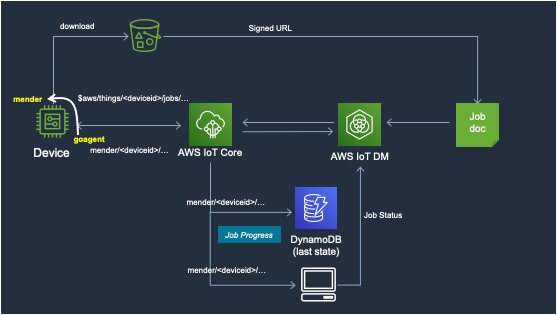
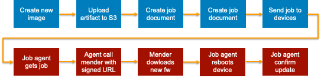
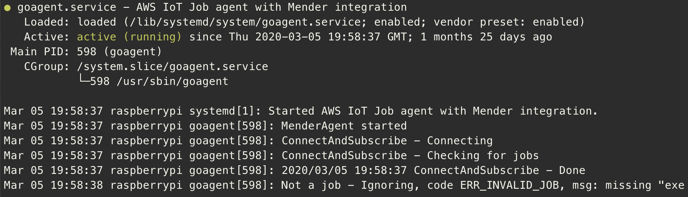

# AWS IoT Jobs and Mender integration demo

This demo show show to integrate AWS IoT Device Management Jobs with the mender client in order to perform safe system OTA upgrades.

## Architecture

The following diagram depict the architecture of the solution we are going to build.



## Process

The process that the system we are building implements is the following:



The steps in the blue boxes are performed in the cloud, the red boxes on the device.

## Prerequisites

In order to build and run this demo, you need the following:

* A Linux enviroment
* A Raspberry Pi board. This demo has been tested with a Raspberry Pi 3 B+ board, but any other board supported by the mender tool would do. If using other boards, you might need to adapt the cross compiling option for Go and change some settings in the `mender-env.sh` file
* An SD card with at least 8Gb of space
* A computer with an SD Card reader
* The [Etcher](https://www.balena.io/etcher/) tool to write the image to the SD Card. Any other tool you are familiar with would also do, including `dd`. 
* The [Golang tools](https://golang.org/dl/) for the platform on which you will develop. Ensure you have go version 1.12 or above (`go version`).

In this document I am assuming you'll be using an AWS Cloud9 environment. If nevertheless you are running this in another environemnt I'll assume you know what you are doing and will be able to adapt the commands as needed.

## Create an AWS Cloud9 instance

For this demo, I recommend to use an [AWS Cloud9](console.aws.amazon.com/cloud9) instance to install and run the tools, especially if you have a Windows laptop.

Create a new AWS Cloud9 instance using the console. 
* Click on this [link](https://console.aws.amazon.com/cloud9/home/create) to open the console
* Enter a name and click `Next step`
* Leave all settings as-is but change Platform to **Ubuntu**
* Click `Next step`
* Click `Create Environment`

Wait for the instance to be initialized.


### Resize the EBS volume

Cloud9 comes with a default 8Gib volume, which is too small for building a full Raspbberry Pi image.
Once the instance is up and running, select the top folder in the explorer on the left and then **File | New File**. Name the file `resize.sh` and copy the following script:

```bash
#!/bin/bash

# Specify the desired volume size in GiB as a command-line argument. If not specified, default to 20 GiB.
SIZE=${1:-20}

# Install the jq command-line JSON processor.
sudo apt install -y jq

# Get the ID of the envrionment host Amazon EC2 instance.
INSTANCEID=$(curl http://169.254.169.254/latest/meta-data//instance-id)

# Get the ID of the Amazon EBS volume associated with the instance.
VOLUMEID=$(aws ec2 describe-instances --instance-id $INSTANCEID | jq -r .Reservations[0].Instances[0].BlockDeviceMappings[0].Ebs.VolumeId)

# Resize the EBS volume.
aws ec2 modify-volume --volume-id $VOLUMEID --size $SIZE

# Wait for the resize to finish.
while [ "$(aws ec2 describe-volumes-modifications --volume-id $VOLUMEID --filters Name=modification-state,Values="optimizing","completed" | jq '.VolumesModifications | length')" != "1" ]; do
  sleep 1
done

# Rewrite the partition table so that the partition takes up all the space that it can.
sudo growpart /dev/xvda 1

# Expand the size of the file system.
sudo resize2fs /dev/xvda1
```

Save the file. In the terminal window at the bottom of the IDE, execute the following:

```
chmod +x resize.sh
sudo ./resize.sh
```

## Build the image and the mender artifact

### Install mender-convert

`mender-convert` is a tool provided by the mender.io project. 
You can read more about mender convert tool [here](https://github.com/mendersoftware/mender-convert), and you can get an overview on how to use it by following this [blog post](https://hub.mender.io/t/raspberry-pi-3-model-b-b-raspbian/140).

Use the `~/environment` folder as your working dir and follow the instruction in this [blog post](https://hub.mender.io/t/raspberry-pi-3-model-b-b-raspbian/140). Stop after you have built the docker image. 

NOTE: if you get a warning about `Could not get lock...`, wait another 60sec os so. There are some background scripts finalizing the configuration of the AWS Cloud9 instance.

### Obtaining and building the goagent 

To build the `goagent` run:

```bash
git clone https://github.com/aws-samples/aws-iot-jobs-full-system-update
cd aws-iot-jobs-full-system-update/files
env GOOS=linux GOARCH=arm GOARM=7 go build ../goagent.go 
```

### Copy configuration files

You need to copy some additional files to the `mender-convert/files` directory which are needed in order to build the image.

```bash
cd ~/environment/mender-convert/files
cp ~/environment/aws-iot-jobs-full-system-update/files/* .
```

### Raspbian

Download the Raspbian image and extract it:

```bash
cd ..
mkdir -p input
cd input
wget http://downloads.raspberrypi.org/raspbian_lite/images/raspbian_lite-2019-04-09/2019-04-08-raspbian-stretch-lite.zip
unzip raspbian_lite-2019-04-09/2019-04-08-raspbian-stretch-lite.zip
```

### Patching `mender-convert`

While in the `mender-convert` folder run the following command to patch the build scripts in order to get the Job Agent and the client certificates on the image.

```bash
cd ~/environment/mender-convert
patch -b -z .bak rpi-convert-stage-5.sh ./files/patch.txt
```

The patch is adding the following to the standard mender script:
* copy the goagent file into `/usr/sbin`
* creates the `/etc/goagent` folder
* copies the root CA, device certificate and private key into the `/etc/goagent` folder
* installs a systemd service file to start the `goagent` on boot
* enable the ssh service in order to connect
* installs a `wpa_supplicant.conf` file into `/etc/wpa_supplicant/` to connect to a wireless network in case an Ethernet cable connection is not available


### Enable the connection to AWS IoT

The goagent connects to AWS IoT over MQTT in order to receive the commands sent by the AWS IoT Jobs service. MQTT connections are encrypted via TLS and secured via mutual TLS authentication. For this we need to have a private key and a device certificate to identify and authenticate the device. In a real production environment the private key would be generated in a secure way on the actual device and be accessible to the agent, for example using a secure element. The device certificate would then be obtained by issuing a CSR (certificate signing request) that would be signed by a CA recognized by AWS IoT. You can find an implementation of this process [here](https://github.com/aws-samples/iot-provisioning-secretfree)

For this demonstration, we are going to generate the private key and the certificate using the AWS IoT console and then transfer them to the image via the `mender-convert` tool. 

* Go to the AWS IoT Console by clicking on this [link](https://console.aws.amazon.com/iot/home?#/create/provisioning)
* Click on **Create a single thing**
* Enter a Name, eg "rpi-mender-demo" and click **Next** at the bottom of the page
* Click on **Create certificate**
* Download the certificate for this thing and the private key.
* Click on **Activate**
* Click on Done

Select **Secure | Policies** and click on Create (or click on this [quick link](https://console.aws.amazon.com/iot/home#/create/policy))

Enter a name for the policy, eg "agent-policy" and click on **Advanced mode**. 

In the editor, delete all the text and copy paste the following:

```json
{
  "Version": "2012-10-17",
  "Statement": [
    {
      "Effect": "Allow",
      "Action": "iot:*",
      "Resource": "*"
    }
  ]
}
```

Click on **Create**

Select the **Manage | Things** menu, click on the thing you just created (eg "rpi-mender-demo"), and then on **Security**. Click on Actions|Attach Policy and select the policy you created in the previous step.

### Transfer the certificates

Back in the Cloud9 instance, select the `mender-convert/files` folder in the navigation pane on the left. Then, select **File** in the top menu bar and **Upload local files...**. Select the certificate and private key you downloaded before or drag&drop them on the dialog box. 

Close the dialog box.

Using the file explorer or the terminal, rename the files to `cert.pem` and `private.key` respectively.

For the mutual TLS authentication to work we also need the server certificate. Run the following command in the terminal window to save the server certificate locally.

```bash
cd ~/environment/mender-convert/files
curl -o rootCA.pem https://www.amazontrust.com/repository/AmazonRootCA1.pem
```

### Update the goagent configuration file

`goagent` uses a configuration file to get the parameters needed to connect to AWS IoT. The file can be found in the `mender-convert/files` folder.

Open the file in the Cloud9 editor and provide the following information:

* `endpoint` - it can be found [here](https://console.aws.amazon.com/iot/home#/settings)
* `thingId` - the name of the Thing you have created
* `clientId` - use the same name as for the thingId

Save the modifications

### Build the SD card image

Now we have all the necessary bits and pieces to build the image.
Run the following to generate the image and the mender artifact

```bash
chmod +x files/mender-env.sh
./files/mender-env.sh 2019-04-08-raspbian-stretch-lite
```

### Transfer the image

Once the above process is finished you'll endup with two relevant files in the `mender-convert/output` folder: 
* an `sdimg` file - this is the full image that need to be transferred to the SD card 
* a `mender` file - this is the mender artifact which is used by the mender client to upgrade the system

The sdimg file must be transferred to your local machine and copied onto the SD card. To do this navigate to the `output` folder in the explorer tab on the left, right-click on the sdimg file and click on Download. Depending on your internet connection it might take some time.

The mender artifact needs to be copied to an S3 bucket where it can later be accessed by the mender client via a pre-signed URL. 

Let's create the bucket. You can either use the [Amazon S3 console](https://console.aws.amazon.com/s3) or the aws cli in the Cloud9 terminal:

```bash
aws s3 mb s3://<bucket name>
```

Once you have created the bucket, copy the mender file to it.

```bash
aws s3 cp ~/environment/mender-convert/output/2019-04-08-raspbian-stretch-lite.mender s3://<bucket name>
```

This bucket and the file are private and cannot be accessed by unauthorized parties.

### Verify the system

Once the image has finished downloading, you copy it to the SD card.
You can use [Etcher](https://etcher.io) or any other command you are familiar with on your system. 

Insert the SD card in your Raspberry Pi and connect the power. It is advisable to have a monitor connected to the Raspberry Pi to check that the boot process executes correctly and to capture the IP address assigned to the Pi depending on the chosen network connection.

If everything is fine you should be able to login to the Raspberry Pi using the default username and password (`pi/raspberry`).

NOTE: in a production setup you would likely disable SSH or at a minimum use stronger passwords or public keys. An more secure method would be to use [AWS IoT Secure Tunneling](https://docs.aws.amazon.com/iot/latest/developerguide/secure-tunneling.html) which can be integrated with the job agent.

You can then verify that the agent is running by executing:

```bash
systemctl status goagent
```

The result should look like the following:




## AWS IoT Jobs

It is now time to test the agent. As we are going to use URL signing, we first have to create a Role that AWS IoT Device Management can assume to create the pre-signed URL for the mender artifact. 

### Create a Job Document

First we have to create a Job Document and upload it to an S3 bucket. 

In the Cloud9 IDE, create a new file in the top folder with the following content. Let's call it `menderjob.json`. Replace \<BUCKET\> with the name of the bucket where you placed the mender artifact.

```json
{
    "operation": "mender_install", 
    "url": "${aws:iot:s3-presigned-url:https://s3.amazonaws.com/<BUCKET>/2019-04-08-raspbian-stretch-lite.mender}"
}
```

Copy the file to the S3 bucket with the following command. For BUCKET we are going to use the same bucket we created for storing the mender artifact:

```bash
aws s3 cp ~/environment/menderjob.json s3://<BUCKET>
```

### Create an AWS IoT Job

It is time now to create AWS IoT Job containing the information necessary for the de
Go the AWS IoT Console and select **Manage|Jobs**. Click on **Create Job**. You can also use this [quick link](https://console.aws.amazon.com/iot/home#/create/job).

Select **Create a custom job**, then enter a Job ID, for example "mender-update-1". 

* Under **Select devices to update** select the Thing you have created earlier. 

* Under **Add a job file** select the bucket and then the `menderjob.json` file.

* Under **Pre-sign resource URLs** select **I want to...** and select **Create Role**. Enter a name and then click on **Create role**. In **URL will expire at this time** select **1 hour**.

Leave the rest as-is and click **Next** and then click **Create**.


## Monitoring the progress

AWS IoT Jobs has a rather coarse reporting for job progress avaiable to other subscriber than the device itself.

To overcome this limitiation, the goagent publishes the output of the mender command to a dedicated topic, so that a montioring application can easily follow the progress.

In the AWS IoT Console, select **Test** and subscribe to `mender/#`.

You should start seeing messages like the following appearing:


```json
{
  "progress": "................................   5% 12288 KiB",
  "ts": 1574763274
}
```

## How does this work?

The goagent has received the new job, and accepted it by reporting back to the AWS Job service an IN_PROGRESS status. It also reports back the current step of the installation progress, in this case "downloading". This information is not available in the console but can be queried via the API prior knowing the jobId and the thingName.

At this stage the mender client is downloading the artifact from S3 via the pre-signed URL and copying it to the inactive partition (`mender -install <s3 presigned url>`)

Once the installation is completed and the mender client exits, the goagent reports back to the AWS Jobs service a status of IN_PROGRESS with step "rebooting" and issues a reboot command. 
When the system comes up again, the goagent will retrieve the current job as pending. Since the stage is "rebooting" it determines that the Raspberry has rebooted and commit the update using the mender client (`mender -commit`), and reports back a successful job. If the commit command fails it means that the system has rebooted to the old partition, and the goagent issues a rollback command (`mender -rollback`) and reports back a failed job.

If the network connection is interrupted during the download or the device reboots for any other reason before the update is completed, the goagent invokes the `mender install` command which in turn download the firmware again.

It is also possible to add a counter to the job reported state to keep track of how many time a download has been attempted and fail the job after N attempts.

## Troubleshooting

### The goagent is not active
On the Raspberry Pi 

```
sudo journalctl -u goagent
```

to check the logs

### The job never shows completed

It might take some time for the mender client to finish the upgrade even after the logs have been showing 99% completion. Be patient. 
If you have an ssh connection to the Raspberry Pi open during the upgrade, it will disconnect on reboot, indicating that the mender command has successfully terminated.
If after this the job still does not show completed, ssh to the Raspberry Pi and check if the goagent is running 

```
systemctl status goagent
```

## Improvements

If you feel brave enough feel free to take this code and:

* Add status reporting (startup time, heartbeat, local IP address) to using thing shadow
* Perform graceful shutdown of other components running on the system before rebooting
* Perform additional system verifications upon reboot before committing

# License

This project is licensed under the Apache-2.0 License.
